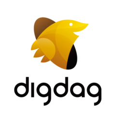

# @size[0.8](バッチ基盤としてのK8S)

#### 株式会社セプテーニ・オリジナル
##### 高嶋 隆博

---

## 自己紹介
- 高嶋 隆博 (@takashima0411)
- 2016年8月入社
	- ScalaでWebアプリケーション開発
	- GCP、GKEでのインフラ構築
	- バッチ基盤の構築
- k8sはこの三月からプロジェクトで利用開始

---

## 会社紹介


#### 主な業務
- デジタルマーケティング支援
- 広告の運用最適化
- 静止画、動画といったコンテンツの制作

Note:

- 製品をどこにどう宣伝していくかという、デジタルマーケティングを支援
- 広告の運用を行ったり画像、動画といったクリエイティブの作成を行っている

---

#### SO社でやっている一例
- 運用のためのデータ収集
- 分析基盤提供
- クリエイティブ制作の効率化支援

Note:

- SO社はその運用のためのデータ収集や分析基盤提供、クリエイティブ制作の効率支援といった面で技術的サポートしている
- 僕のチームの役割は、この中の運用時に使うデータの収集と分析時にデータがすばやく取り出せるようにすることです 

---

### バッチ処理をしている内容
- レポートの収集
- BQでの事前集計

---

#### レポートの収集
- 広告の配信媒体は、広告の見られた回数やクリックされた回数といった成績(レポート)を提供してる。  
- APIを活用しレポートを収集してGCSに保管している。

Note:

- FacebookやGoogleといった大手メディアは、広告の見られた回数やクリックされた回数といった成績(レポート)をAPIから取得できるようにしてくれています。
- レポートはJSONだったり、CSVだったりする。
- レポートはWebの管理画面で閲覧できるほか、APIでも取得できる。
- まずは一日一回それらのAPIにアクセス、必要に応じて加工してGCSに保管している。

--- 
 
#### BQでの事前集計
- レポートデータ量は膨大
- 事前にある程度集計しておかないと日中の分析業務がスムーズに行えない
- BQにデータをロードし集計させ、分析しやすい状態にしたのちRDBに投入

Note:

- BQでの事前集計というのは日中の分析業務時にすばやくデータが活用できるように予め扱いやすい単位に集計しておくことです。
- データ量は膨大なので、事前にある程度集計しておかないと日中の分析業務がスムーズに行えなくなります。
- なので、予めBQにデータをロードし集計させ、分析しやすい状態にしたのちRDBに書き込んでいます。

---

## 弊社のバッチジョブの歴史
- webアプリ同梱
- Akka
- Digdag

Note:

- 弊社ではいろいろバッチジョブとその実行方法を試してきたので、それらから得られた課題を紹介しようかと思います。

---

###  @size[0.8em](Webアプリと同梱しCRON + CURLで起動)


WebアプリケーションのAPIの一つとして提供
- cronとcurlでAPIを叩いて実行
- バッチ用のサーバは専用のものを

Note:

- playframeworkはバッチ用ライブラリなどではなく、Scala製のWebアプリケーションフレームワーク
- 実行はcron用のサーバからcurlでAPIを叩いて実行していた。
- バッチ処理をWebアプリケーションと同じソースコードを流用できるのが強み。

---

#### 問題点
- バッチが不安定
- リソースの活用が効率的ではない
- 部分的な再実行ができない
- 実行履歴がひと目でわからない

Note:

- メディアの中にはAPIが不安定なものがあり、それに引っ張られてバッチ全体として不安定になってしまったものがある
- バッチの実行環境が統一されていない
- サーバごとにログがあるので、バッチのログを見るには各バッチサーバにログインして見る必要があった
- 一応分析業務は日中にしかないので、深夜遅くなったとしても要件的には大きな問題があったわけではなかった
- しかし、日中の負荷に比べてバッチ中の負荷がとても大きくバッチ時にリソースを合わせると日中にリソースが無駄になってしまう

- 作りの問題ではあるが、バッチのやり直しは容易であるものの、途中から再開というのは難しい
    - 成功したところまではそのままで、失敗したところから再開したいことは多い

- バッチ用の管理画面などはなかった。
- 失敗時は通知していたが成功時には特に何もしていなかったので実は実行されていないとかの問題もあった

---

### Akkaによるバッチ


アクターモデルによりバッチを実装
- スーパーバイザによるエラーハンドリング
- akka clusterによるスケール

Note:

- この方法では主にバッチの不安定性と、リソースの問題を解決したかったのでAkkaを採用
- 詳細は省くが、AkkaはErlangで用いられるActorModelをScalaで実装したもの
    - エリクソンが電話効果に出使っていることで有名
    - 落ちてはいけないシステムなどで活躍
- 問題があった場合に復帰しやすいようにしたいというモチベーション
    - アクターモデルはスーパーバイザによって失敗がハンドリングされるので、リトライや通知がやりやすい
    - メディアの中にはAPIが不安定なものがあり、何度か実行するとうまくいくとがあったりする。
    - 不安定なAPIに対し、スーパーバイザを利用することでリトライや通知といった戦略を練りやすい
- リソースの問題はAkkaClusterでかいけつできる予定だった
    - Clusterはアクターの実行場所であり、ノードの途中参加・離脱ができる
    - リソースの問題でAkkaClusterを用意できず、はやり効率で的ではない状態に

---

#### 問題点

- アクターの持つ親子関係の管理
- 部分的な再実行が難しい
- リソースが効率的ではない

Note:

- アクター同士のつながりが分かりづらくバッチの全体像が想像し辛い
- 親子関係図を見ながらでないといじれない
- これは作りの問題だが、バッチは途中から再開したいことも多い
- 人的なリソースの関係でClusterが用意しきれず結局リソースが無駄なままに

- しかし、個々のタスクが一つのアクターとなったのが設計ミスだったとの反省がある
    - ワークフローエンジンそのものをActorで作るのは良さそうだけど、バッチをこれで作るにはちょっと向いてなかったかも。反省
- バッチの場合は絶対失敗してはいけないというよりは失敗しても気軽に再実行できるように作っておいたほうが便利

---

### Digdagによるバッチ



- Treasure Data社が主導
- ワークフローの記述はyaml
- BQやTDとの相性がいい
- Javaで機能の追加/変更が出来る

Note:
- TD社が作成しているワークフローエンジン。トレジャーデータとの統合が用意であることとJavaで書かれいてることが特徴。
- また、yamlは小さいタスクで細かく分けやすい
- 弊社はScalaが中心の会社なので、Javaで拡張をかけるのはありがたい

--- 

### @size[0.8em](ワークフローエンジンを導入するメリット)

- 様々なオペレータが用意されていてる
- ジョブの実行準備や部分的な並列実行が容易
- 成功/失敗の通知やリトライなどもやってくれる
- ログの履歴が一箇所にWebコンソールにまとまっている

Note:

- やはり餅は餅屋。ワークフローエンジンを導入したことで多くの問題が解決するだけでなく見えてなかったニーズも一緒に解決
    - 再実行してもだめだったやつはあるかとか、おおよそどれくらいかかっているかを履歴からみれるだとか
- これらのメリットはおそらくDigdagだけではなくおおよそのワークフローエンジンで可能
- オペレータというのはタスクのテンプレートのようなもの。S3へのファイル転送とか定形作業がまとめられている
- ShellオペレータやRubyオペレータで自分でそのつど自分で定義することもできる
- 今までログの収集や、ジョブの実行結果/履歴というのはサーバに入ってみていたのがその必要がなくなった
- Digdagの場合、標準ではemailやhttpといったオペレータがあるが、弊社では通知は主にSlackを活用
- 今まで途中まで失敗したときに、そこから再開とかはできなかったがDigdagならタスクを小さくしたおかげもありボタンひとつで

---

## Digdagでの失敗
- オペレータで重い処理を実行した
- Digdagのスケジューリングの関係で影響甚大

Note:

- Digdagの問題ではなく使い方のミス
- オペレータは何も考えずに実行すると、Digdagのワーカーがいるサーバで実行される
- javaとかembulkを呼び出してメモリを食うことがありワーカー全体が非常に重い状態に

- スケジューリングがあまり理解出来ておらずすでにいっぱいいっぱいのサーバにまたタスクを振り当てられる等がつづいた
- 僕の理解が正しければDigdagのワーカーはDBをポーリングしているだけなのでタイミングによってはどこかのワーカーに偏る可能性がある
- 偏ったマシンで重い処理が実行されてしまうと他の処理を巻き添えに死ぬ可能性もある。終わらなくなるとか。

- しかし、今まで問題だった課題はDigdagがだいたい解決してくれたのであとはリソースが問題
- そんなときに次のプロジェクトで利用しようと勉強していたkubernetesのJob機能をしった
- うまく活用できないだろうか？

---

## k8s job

```
apiVersion: batch/v1
kind: Job
metadata:
  name: pi
spec:
  template:
    spec:
      containers:
      - name: pi
        image: perl
        command: ["perl",  "-Mbignum=bpi", "-wle", "print bpi(2000)"]
      restartPolicy: Never
  backoffLimit: 4
```
Note:
- 定義はこんなかんじ。公式のドキュメントにもあるサンプル。円周率を計算してログに出力するだけ。
- 指定したコンテナにコマンドを与えて何らかの処理を実行できる。
    - 更に失敗した場合にリトライさせたり、cronで定期実行でき簡単なバッチなら組めそうなくらい充実

---

### k8sのJOB機能だけではだめなの？
- 比較的シンプルなタスクを実行するなら十分
- いくつかのタスクを組み合わせるならワークフローエンジンを使ったほうが良い
   
Note:

- Jobだけでうまくいくであれば全然問題ない
- しかし複数あるステップあるようなものには向いていない印象
    - Aが終わったらBを実行、Bが終わったらCとDとEを平行に実行、Cが終わったらFを…というのは悪夢

---

## Digdag meet's Kubernetes
- リソース問題はkubernetesが解決！
- ローカルでの動作確認等も楽
- 秘密情報はk8sでまとめて管理
- ログはStackdriverLoggingに集約

Note:
- JOBはCPUやメモリを設定しておけばいい感じに開いてるノードに振り分けてもらえる

- 日中のバッチがない時間と、バッチ中のリソースの要求量の差を吸収してくれる
- 更に必要であればノードの増減までやってくれる

- Dockerイメージを実行すれば簡単に実行して確認できる
- 必要なライブラリ等はすべてDockerImageで用意すればいい
- K8Sで動かしてみるのも簡単
- あとはそれをDigdagから実行できるようにするだけ

- Secretの情報をk8sに寄せられるため(Digdagのそれに比べ)秘密情報が楽に管理、配布できる
- Digdagでもそういった機能があるのだが、これはDigdagから、こっちはk8sからとしてしまうと面倒なのでk8sに寄せるのがおすすめ
- Podへのマウントや環境変数へのバインドで受け渡し。普通のSecretと同じ。

- Digdagだけだったときに比べて動作確認がやりやすくなった。ローカルでの環境構築は不要でDockerに任せられるし。
- ローカルでやる場合はローカルでDigdagサーバを立てて実行している。
- そうすると計算リソースはk8sに頼れるのでマシンが重くならない

---

## @size[0.8em](Digdagからk8s jobを呼び出す方法)

- Shellオペレータを通してkubectlでJOBを実行
- コストを鑑みて、オペレータを自作

Note:

- はじめはシンプルにShellでやっていた
- しかし、Digdagのテンプレートへの変数埋め込みはshellの環境変数埋め込みと似ていて紛らわしい。
- 各変数がDigdagによって埋められるのか、k8sのjob上で埋められるのかが分かりづらく実行時エラーになりやすい。
- また、Digdagからk8sへの環境変数リレーも結構面倒くさくて忘れやすい

- この面倒臭さの原因はk8sのyamlにいい感じに変数を埋める方法がないのがよくなかった

- なのでDigdagようにオペレータを作成した
- オペレータを自作した場合、Digdagのテンプレートエンジンを利用できるようになる
- k8sのjob定義に直接変数を埋め込むことができるようになり、変数はDigdagだけのものになりわかりやすく。

- しかし、kubernetes-client/javaはあまりにあまりにもなので、かなり辛かった
- 特定の操作を呼ぶと成否を問わずExceptionが発生するとか

---
   
## Google Cloud Composer


- [Google Cloud Composer](https://cloud.google.com/composer/)
- Pythonでワークフローを定義

Note:

- 実はGCPからAirflowというワークフローエンジンが提供されています。
- これからワークフローエンジンを用意する人はまずこちらを顧慮してみるといいと思います。
- 僕がDigdagを構築した際はあるにはあったのですが、まだ日本になかったので断念。

---

## まとめ

- ワークフローエンジンには重い処理をさせない！
- 重い処理はk8sへ！

Note: 

- 今回はワークフローエンジンとしてDigdagについて紹介しましたが、他のワークフローエンジンでも基本は同じ。
- できるだけワークフローエンジンから実際の処理を引き剥がし、実行をk8sに寄せることでリソース管理が簡単になります。

---

## 補足

- Digdag on GCP
- Digdag with RBAC
- testable workflow
- ...etc

Note:

- ここでは紹介しなかったことがたくさんあります。
- Digdagの環境構築、ワークフローエンジンようにRBACを設定などなど…もし気になったらこのあとぜひ聞いてください

---

## Thank you!

Note:

- 弊社ではエンジニアを募集しています。K8SとかScalaとか興味がある人は是非お声掛けください。